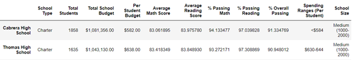
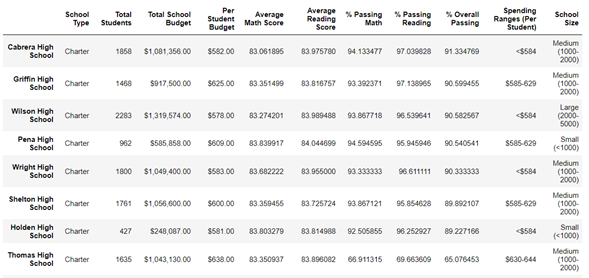

# School_District_Analysis
## OVERVIEW
Maria asked for our help in order to analyze some student data regarding their math and reading tests scores, in order to analyze the schools funding and find trends in their performance. The results of this initial analysis are being used by the school board and superintendent, to make decisions about school budget assignment and prioritization.
### Purpose of the analysis
Because apparently after the first school data analysis, some evidence of academic dishonesty appears. Maria asked to change the analysis in order to ignore the math and reading test results for the 9th grader of the Thomas High School, making the purpose of this job, run again the school district analysis, using only the information of the corresponding test results of the 10th, 11th and 12th grades of Thomas High School and identify the impact of this changes in the individual outcomes of Thomas High School and the overall results for all the district.
## RESULTS
•How is the district summary affected?

When considering all the school information, the district summary showed that for all the 15 schools, with a total number of 39,170 students, the percentage of students passing math, reading and both is **74.9808%**, **85.8054%** and **65.1723%** respectively. When extracting from the district summary, the data of the 9th graders of the Thomas High School, the new percentages moved to **74.7604%** of students passing math, **85.6597%** of students passing reading and just **64.8557%** of students passing both, which means only a barely difference of **0.2204%**, **0.1457%** and **0.3166%** for each valuation.
We can see the above data in the following results:

             District summary (Original Analysis)

            District summary (without 9th graders THS)

•	How is the school summary affected?

The school summary is affected only in the information corresponding of the Thomas School High, because it filtered by the School name, the data of “Average Math Score”, “Average Reading Score”, “% Passing Math”, “%Passing reading”, and “%Overall Passing”  now shows the corresponding results only considering the test results of the 10th, 11th and 12th graders. It changed as shown below:

Data | Original Results | Without 9th graders | Difference
--- | --- | --- | ---
Average Math Score | 83.4183 | 83.3509 |0.0674
Average Reading Score| 83.8489 | 83.8961 | -0.0472
% Passing Math|93.27% | 66.91% | 26.36%
% Passing Reading| 97.31%| 69.66%|27.65%
% Overall Passing| 90.95%| 65.08%|25.87%

As we can see, all the passing percentages were affected because we are not considering the 9th graders, but curiously the average of math score and the average of reading score didn’t changes significantly.

•	How does replacing the ninth graders’ math and reading scores affect Thomas High School’s performance relative to the other schools?

If we compare the results of Thomas High School with the results of the other schools, when including the results of the 9th graders, the school was in the second place, considering the %Overall passing; without taking in account those data, now the Thomas High School is in the 8th place of all district schools, as we can notice in the following images:

            THS original place in the district analysis

                    THS place without the 9th graders 

•	How does replacing the ninth-grade scores affect the following:

*Math and reading scores by grade*: It just gave a **”NaN”** answer when trying to get the information of the 9th grade. The results of 10th, 11th and 12th grades are the same as soon as they are independent from the ninth-grade data.

*Scores by school spending*: Because of the change in the number of students, the “Per student Budget” now is greater. As a result of this, the Thomas High School is an outlier of the ranges defined. With a per school budget of **$888.52.**

*Scores by school size*: Because of the change in the number of students, the school didn´t have a change in its size, with a total of **1,174** students just for the 10th, 11th and 12th grades, the school is still in the medium range.

*Scores by school type*: This information changed for the “Charter” type, in the results of “Average Math Score”, “Average Reading Score”, “%Passing Math, “%Passing reading” and “%Overall Passing”, because all the calculations are made with the new number of students, just including the ones of the 10th, 11th and 12th grades.

## SUMMARY
After running the new analysis for the district schools, I think that is not so easy to conclude if there were some dishonesty troubles with the 9th grades results. Is pretty obvious that some of the results were going to be affected for just considering the outputs of the 10th, 11th and 12th , for example, the budget per capita, but the observed variation of the “Average Math Score” and “Average Reading Score” just for the Thomas High School is very low. The greatest difference is in the “% passing math”, with about a 27.65%, but that´s approximately the percentage of lacking students in the analysis. In conclusion, I think a deeper analysis needs to be done with some statistics measures, in order to determine if there were academic dishonesty with the 9th graders. 
